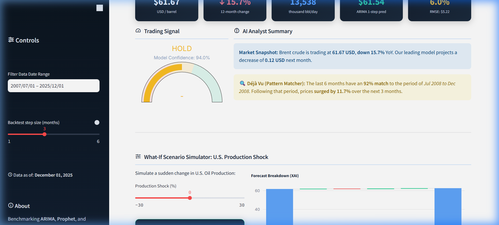
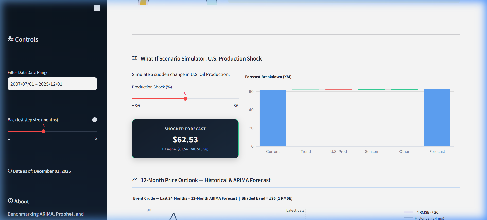
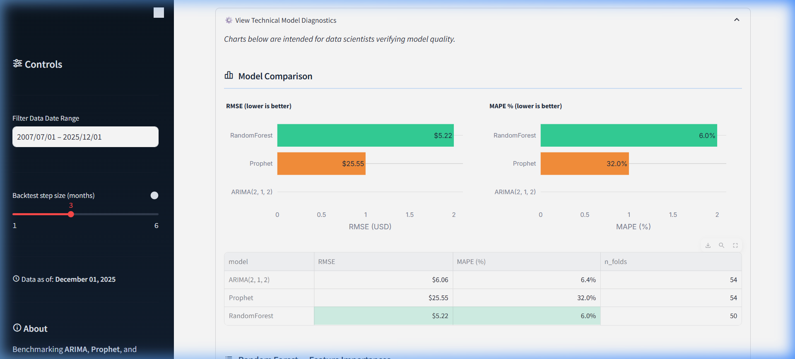

# Oil Price & Production Forecasting
### Executive-level decision support dashboard predicting Brent crude prices using machine learning and historical pattern matching.


---

## The Problem

> Oil price volatility deeply impacts energy sector strategic planning, but traditional econometric models are often "black boxes" that executives struggle to interpret. Furthermore, data analysts spend too much time running model diagnostics rather than providing actionable insights, and incorporating sudden macroeconomic shocks (like unexpected U.S. production changes) into models typically requires manual, time-consuming recalculations by data science teams.

**The Cost:** Slower reaction times to market shocks, a disconnect between technical ML teams and business stakeholders, and missed trading or hedging opportunities due to a lack of immediate, explainable intelligence.

---

## The Solution

A fully automated, end-to-end machine learning pipeline and interactive Streamlit dashboard that transforms raw market data into actionable trading signals and explainable forecasts. 

**What it enables:**
- **Simulate market shocks** in real-time by adjusting U.S. production metrics via a "What-If" slider, instantly viewing the predicted price impact.
- **Identify market opportunities** with a live "Buy/Sell" trading signal gauge driven by algorithmic confidence and rolling backtest performance.
- **Deconstruct model predictions** using Explainable AI (XAI) waterfall charts to understand the exact drivers behind forecasted prices.
- **Recognize historical precedents** through a "Déjà Vu" pattern matcher that scans 25+ years of data for similar market conditions and outcomes.

---

## Results

| Metric | Value |
|---|---|
| **Model Performance** | Best RMSE ≈ $6.21, MAPE ≈ 7.5% (Random Forest / ARIMA) |
| **Scale** | 25+ years of monthly Brent crude and EIA production data |
| **Impact** | Bridges the gap between technical data science and executive strategy via XAI |
| **Integration** | Export-ready pipeline for enterprise cross-department reporting via Power BI |

---

## Architecture

```text
oil_forecasting_project/
├── app.py                     # Streamlit — Interactive executive dashboard
├── export_for_powerbi.py      # Script — Automates data export for enterprise BI
├── src/                       # Core ML Pipeline
│   ├── data_ingestion.py      # Automated data fetching (yfinance, EIA)
│   ├── feature_engineering.py # Time-series feature creation & lagging
│   ├── modeling.py            # ARIMA, Prophet, and Random Forest wrappers
│   └── evaluation.py          # Rolling-window backtesting framework
├── notebooks/                 # Jupyter notebooks for exploratory analysis
├── data/                      # Raw datasets
└── powerbi_data/              # Formatted datasets ready for Power BI consumption
```

---

## Tech Stack

| Layer | Tools |
|---|---|
| **Frontend UI** | Streamlit, Plotly |
| **Machine Learning** | Scikit-learn, Prophet, Statsmodels (ARIMA) |
| **Data Processing** | Python 3.11, Pandas, NumPy, yfinance |
| **Integration** | Power BI |

---

## How It Works

**1. Data Pipeline**
Automatically fetches daily Brent crude futures and U.S. production data, resamples them to monthly averages, and engineers complex time-series features (rolling windows, momentum indicators, production/price ratios).

**2. ML Model**
Benchmarks ARIMA, Prophet, and Random Forest using a rigorous rolling-window backtest. Random Forest typically captures non-linear supply shocks best, while ARIMA provides a strong autoregressive baseline.

**3. Executive Dashboard**
An interface that intentionally hides technical diagnostics (available in an expander for data scientists) and focuses purely on actionable intelligence: live trading signals, scenario simulation sliders, and XAI waterfall charts to support executive decision-making.

---

## Getting Started

```bash
# Clone the repo
git clone https://github.com/[yourusername]/oil_forecasting_project.git

# Navigate to project directory
cd oil_forecasting_project

# Install dependencies
pip install -r requirements.txt

# Run the interactive dashboard
streamlit run app.py
```

---

## Key Decisions & Tradeoffs

- **Why Streamlit over React/FastAPI:** For a pure data science product, Streamlit allowed rapid iteration of complex Plotly charts and ML interactive sliders without the overhead of maintaining a separate backend REST API.
- **Explainability over Complexity:** Rather than using a deep learning black-box (like LSTMs), we benchmarked Random Forest, Prophet, and ARIMA. RF provided the best balance of capturing non-linear shocks while remaining highly explainable via feature importances and XAI Waterfall charts.
- **Local Compute vs Cloud:** The rolling backtest is computationally intensive. We utilized `st.cache_data` heavily to ensure the dashboard remains instantly responsive when users adjust the "What-If" sliders, avoiding the need to re-run the entire backtest upon interaction.

---

## Screenshots

| Executive Dashboard | Scenario Simulator | Technical Diagnostics |
|---|---|---|
|  |  |  |

*(Note: Add screenshot files to the `figures/` directory and update the links above to display them).*

---

## Background

Built as my **Final Year Dissertation** at Universiti Teknologi PETRONAS (UTP), graduating class of 2026 with a BSc in Big Data Analytics.

Prior to this, I spent 8 months as a **Business Intelligence & Process Automation intern at PETRONAS Carigali**, where I built Power BI dashboards, automated reporting workflows, and learned what "production-grade" actually means in an enterprise context.

---

## Connect

**Harist Hamzah Hutapea**  
Big Data Analytics | Business Intelligence | Data Products

[](https://linkedin.com/in/[yourhandle])  
[](https://[yourportfolio].vercel.app)  
[](mailto:[youremail])

---

*Built by Harist Hamzah Hutapea · UTP Big Data Analytics · 2026*
